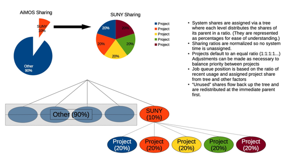

:toc: macro
:toc-title:
:toclevels: 99

# AiMOS On-Board Documentation

image:Work-In-Progress.png[]

toc::[]

## What is AiMOS?
The IBM Research AI Hardware Center is a global research hub headquartered in Albany, New York. 
The center is focused on enabling next-generation chips and systems that support the tremendous processing power and 
unprecedented speed that AI requires to realize its full potential.  
AiMOS (short for **A**rtificial **I**ntelligence **M**ultiprocessing **O**ptimized **S**ystem) serves as the test bed for 
the New York State-IBM Research AI Hardware Center. 

The following sections will provide you the basic steps to get you on-board to the AiMOS environment.  However if you need any assistance, please post your questions to the https://ibm-research.slack.com/archives/CR271K4M7[aimos slack channel] or send email to kvtran@us.ibm.com and herger@us.ibm.com.

## How to apply for a user id on AiMOS?

You need to fill out the following forms:

### Project Information 
A user must belong to one or more projects.  You use the Project Information form to create a new project or updated the existing projects to add your name to the project.

https://secure.cci.rpi.edu/wiki/images/6/6b/CCI_Project_Information_20140612.pdf

### CCI User Information  
https://secure.cci.rpi.edu/wiki/images/b/b1/CCI_User_Information_20140612.pdf

### CCI User Responsibility Agreement
https://secure.cci.rpi.edu/wiki/images/b/b3/CCI_User_Responsibility_Agreement_20140612.pdf

Sign and send the forms to herger@us.ibm.com
Once the forms are processed, you will receive emails from the system administrators at RPI for your account ID and temporary password. The next step is to set your password. 

### Set your password 
You will receive the link  similar to this, https://secure.cci.rpi.edu/password/?a=XXXXXXXXXXXXXXXX&b=1, where XXXXXXXXXXXXXXXX is your temporary password. You need to use the link to reset your password.

### Set the Challenge Word 
The next step is choose and set the Challenge Word: https://secure.cci.rpi.edu/challenge/

### Set the Personal Identification Code (PIC)
The last step is to choose the Personal Identification code (PIC). The PIC is case-sensitive and is made up of at least 4 numbers and/or letters. No special characters may be used. Do not use your bank PIN, account name, first or last name, or organization.

* Install "Google Authenticator" app on your mobil device
* Go to https://secure.cci.rpi.edu/totp
**  Enter your User ID, Password, the Challenge Word, the chosen PIC; Click Setup TOTP.
**  You will get  QR code.
* Go to the Google Authenticator app on your mobile device and scan the QR code.

You now have everything you need to login to a landing pad node.

## What is the landing pad nodes?

For more information see https://secure.cci.rpi.edu/wiki/index.php?title=Landing_pad

Landing pad nodes are nodes that have external ethernet IP which you can login from your laptop or desktop.

There are 4 landing pad nodes for AiMOS:

* blp01.ccni.rpi.edu
* blp02.ccni.rpi.edu
* blp03.ccni.rpi.edu 
* blp04.ccni.rpi.edu 

## How to login to AiMOS?

*  First you need to ssh to one of the landing pad nodes.  For example:

....
$ ssh blp01.ccni.rpi.edu
login as: BMHRkmkh
Using keyboard-interactive authentication.
PIC+Token:
Using keyboard-interactive authentication.
Password:
Last login: Thu Feb 27 15:21:56 2020 from 70.113.9.236

               ** CCI SSH Gateway (Landing pad) **
**                                                             **
**     Please report all support and operation issues to       **
**     support@ccni.rpi.edu                                    **
**                                                             **
**     On-line documentation for the systems can be found at:  **
**     https://secure.cci.rpi.edu/wiki                         **
**                                                             **
**     CCI does not provide any data backup services. Users    **
**     are responsible for their own data management and       **
**     backup.                                                 **
**                                                             **
**     Use is subject to the terms of the policy for           **
**     Acceptable Use of CCI Resources.                        **
**                                                             **

....

* Set up passwordless.  You only need to do this once. 

....
ssh-keygen –t rsa
cp ~/.ssh/id_rsa.pub ~/.ssh/authorized_keys
....

* From the landing pad node, you ssh to the front end node.  There are two front end nodes: dcsfen01 and dcsfend02. For example: 

....
[BMHRkmkh@blp01 ~]$ ssh dcsfen01
Last login: Fri Feb 28 11:43:56 2020 from 172.31.29.1

                   ** CCI DCS front-end node **
**                                                             **
**     Please report all support and operation issues to       **
**     support@ccni.rpi.edu                                    **
**                                                             **
**     On-line documentation for the systems can be found at:  **
**     https://secure.cci.rpi.edu/wiki                         **
**                                                             **
**     Use is subject to the terms of the policy for           **
**     Acceptable Use of CCI Resources.                        **
**                                                             **
....

* Set up proxy on the front end node by adding the following lines to your .bashrc

....
export http_proxy=http://proxy:8888
export https_proxy=$http_proxy
....

## What is the disk space on the nodes?

The same GPFS filesystems are mounted on all the front end nodes and compute nodes in AiMOS.

This is the general user level filesystem view.
....
/gpfs
	/u
  		/home
   			/PROJ
    				/USER
						/barn
						/barn-shared
  						/scratch
						/scratch-shared
....

* Each user is allocated a 10 GiB quota which includes user's home, barn and barn-shared.  This space is intended for long term storage and it will be saved. 
* home directory contains a link to scratch, the user's personal scratch space.  It also contains a link to scratch-shared, the project's shared scratch space.
* scratch and scratch-shared are meant as a temporary staging area for performing computation. Performance in this directory will be better than in the home or barn areas. This space does not have a quota. However, it will periodically be purged of files that are not used (either by read or write operation) in the last 56 days.  WARNING: If purging files that are not used in the last 56 days is not  sufficient to maintain enough working space, the RPI team may purge all files with with advance warning.

Due to the total space of 10 GiB in home, barn and barn-shared, it is best to use these directories to store "dot files", configuration files, scripts, or small programs needed to customize the working environment. You should use scratch and scratch-shared for things that require more space.

## How is slurm workload manager configured in AiMOS environment?

Slurm (used to be Simple Linux Utility for Resource Management) is the cluster management and job scheduler for AiMOS. 

The fairshare allocation is used in the environment:

* Each key partner (e.g., IBM, RPI, SUNY is a given a fixed slice of AiMOS expressed as a percentage of the whole system
Within a key partner’s “slice”, group projects are defined. 
* By default, each project gets a fair share of the overall partner level slice.
* Inside each project, users accounts are created. 
* By default, each user gets a fair share of the overall group project level slice

## What are the SLURM Frequently Used Commands?

salloc – allocate resources for a job in real time and start a shell.

....
[BMHRkmkh@dcsfen01 ~]$  salloc -N 1 --gres=gpu:6 -t 15
salloc: Granted job allocation 60780
....

squeue – reports the state of jobs or job step. By default, it reports the running jobs in priority order and then the pending jobs in priority order.

....
[BMHRkmkh@dcsfen01 ~]$ squeue
             JOBID PARTITION     NAME     USER ST       TIME  NODES NODELIST(REASON)
             60780       dcs     bash BMHRkmkh  R       1:07      1 dcs249
[BMHRkmkh@dcsfen01 ~]$ ssh dcs249
Warning: Permanently added 'dcs249,172.31.236.249' (ECDSA) to the list of known hosts.
....

srun – submits a job for execution or initiates job steps in real time.

sattach – attach standard input, output, error and signal capabilities to a current running job or job step.

sbatch – submit a job script for later execution. The script typically contains one or more srun commands to launch parallel tasks.

sbcast – transfer a file from local disk to local disk on the nodes allocated to a job.

scancel – cancel a pending or running job or job step.

sinfo – reports the state of partitions and nodes managed by Slurm.

....
[BMHRkmkh@dcs249 ~]$ sinfo
PARTITION AVAIL  TIMELIMIT  NODES  STATE NODELIST
debug        up      30:00      5 drain* dcs[213,253-254,266],dcsfen02
debug        up      30:00     11  down* dcs[040,074,109,119,121,124,126,168-169,173,270]
debug        up      30:00     20  drain dcs[026,068,086,154,194,199,206,209-211,216,236,242,246,250,255,257,259-260,269]
debug        up      30:00     78  alloc dcs[023-025,027-030,032-036,039,069-073,110-118,120,125,165,170-172,174-193,198,200-205,212,237-241,243-245,247-249,256,261-265]
debug        up      30:00    136   idle dcs[001-012,014-022,037-038,041-067,075-085,087-108,122-123,127-153,155-164,166-167,195-196,207-208,214-215,235,251-252,258,267-268]
debug        up      30:00      3   down dcs[013,031,197]
dcs          up    6:00:00      4 drain* dcs[213,253-254,266]
dcs          up    6:00:00     11  down* dcs[040,074,109,119,121,124,126,168-169,173,270]
dcs          up    6:00:00     20  drain dcs[026,068,086,154,194,199,206,209-211,216,236,242,246,250,255,257,259-260,269]
dcs          up    6:00:00     78  alloc dcs[023-025,027-030,032-036,039,069-073,110-118,120,125,165,170-172,174-193,198,200-205,212,237-241,243-245,247-249,256,261-265]
dcs          up    6:00:00    136   idle dcs[001-012,014-022,037-038,041-067,075-085,087-108,122-123,127-153,155-164,166-167,195-196,207-208,214-215,235,251-252,258,267-268]
dcs          up    6:00:00      3   down dcs[013,031,197]
rpi          up    6:00:00      1 drain* dcs218
rpi          up    6:00:00     13  drain dcs[217,219-222,224-229,231-232]
rpi          up    6:00:00      2  alloc dcs[223,230]
....

smap – reports state information for jobs, partitions, and nodes managed by Slurm.

## How Submit an interactive job via SLURM?

For example, after ssh to one of the front end nodes, run salloc to allocate 1 node with 6 gpu for 15 minutes. After the command returns, you now run squeue command to see which node is allocated for the interactive session.  In the example below, dcs249 is allocated.  Now you can ssh to the node and execute your application.  

....
[BMHRkmkh@dcsfen01 ~]$  salloc -N 1 --gres=gpu:6 -t 15
salloc: Granted job allocation 60780
[BMHRkmkh@dcsfen01 ~]$ squeue
             JOBID PARTITION     NAME     USER ST       TIME  NODES NODELIST(REASON)
             60780       dcs     bash BMHRkmkh  R       1:07      1 dcs249
[BMHRkmkh@dcsfen01 ~]$ ssh dcs249
Warning: Permanently added 'dcs249,172.31.236.249' (ECDSA) to the list of known hosts.
[BMHRkmkh@dcs249 ~]$ ls
barn  barn-shared  etc  Miniconda3-latest-Linux-ppc64le.sh  scratch  scratch-shared  var
[BMHRkmkh@dcs249 ~]$ hostname -f
dcs249.ccni.rpi.edu
....

After the specified time, which is 15 minutes in this example, the node is deallocated and you will no longer be allowed to ssh to the node.

....
[BMHRkmkh@dcs249 ~]$ salloc: Job 60780 has exceeded its time limit and its allocation has been revoked.
   Killed by signal 1.
[BMHRkmkh@dcsfen01 ~]$ ssh dcs249
Access denied: user BMHRkmkh (uid=6112) has no active jobs on this node.
Access denied by pam_slurm_adopt: you have no active jobs on this node
Authentication failed.
....

## How to Submit a batch job via SLURM?

<TBD>

## How to install conda environment?

Download the the Miniconda3 installer if needed.
....
wget https://repo.anaconda.com/miniconda/Miniconda3-latest-Linux-ppc64le.sh
....

Install the miniconda environment to scratch directory.

....
[BMHRkmkh@dcsfen01 ~]$ bash Miniconda3-latest-Linux-ppc64le.sh -p ~/scratch/miniconda3

Welcome to Miniconda3 4.7.12

In order to continue the installation process, please review the license
agreement.
Please, press ENTER to continue
>>>
...
Do you accept the license terms? [yes|no]
[no] >>> yes

Miniconda3 will now be installed into this location:
/gpfs/u/home/BMHR/BMHRkmkh/scratch/miniconda3

  - Press ENTER to confirm the location
  - Press CTRL-C to abort the installation
  - Or specify a different location below

[/gpfs/u/home/BMHR/BMHRkmkh/scratch/miniconda3] >>>
PREFIX=/gpfs/u/home/BMHR/BMHRkmkh/scratch/miniconda3
Unpacking payload ...
Collecting package metadata (current_repodata.json): done
Solving environment: done

## Package Plan ##

  environment location: /gpfs/u/home/BMHR/BMHRkmkh/scratch/miniconda3

  added / updated specs:
    - _libgcc_mutex==0.1=main
    - asn1crypto==1.2.0=py37_0
    - ca-certificates==2019.10.16=0
...
  yaml               pkgs/main/linux-ppc64le::yaml-0.1.7-h1bed415_2
  zlib               pkgs/main/linux-ppc64le::zlib-1.2.11-h7b6447c_3

Preparing transaction: done
Executing transaction: done
installation finished.
Do you wish the installer to initialize Miniconda3
by running conda init? [yes|no]
[no] >>> yes
no change     /gpfs/u/home/BMHR/BMHRkmkh/scratch/miniconda3/condabin/conda
no change     /gpfs/u/home/BMHR/BMHRkmkh/scratch/miniconda3/bin/conda
no change     /gpfs/u/home/BMHR/BMHRkmkh/scratch/miniconda3/bin/conda-env
no change     /gpfs/u/home/BMHR/BMHRkmkh/scratch/miniconda3/bin/activate
no change     /gpfs/u/home/BMHR/BMHRkmkh/scratch/miniconda3/bin/deactivate
no change     /gpfs/u/home/BMHR/BMHRkmkh/scratch/miniconda3/etc/profile.d/conda.sh
no change     /gpfs/u/home/BMHR/BMHRkmkh/scratch/miniconda3/etc/fish/conf.d/conda.fish
no change     /gpfs/u/home/BMHR/BMHRkmkh/scratch/miniconda3/shell/condabin/Conda.psm1
no change     /gpfs/u/home/BMHR/BMHRkmkh/scratch/miniconda3/shell/condabin/conda-hook.ps1
no change     /gpfs/u/home/BMHR/BMHRkmkh/scratch/miniconda3/lib/python3.7/site-packages/xontrib/conda.xsh
no change     /gpfs/u/home/BMHR/BMHRkmkh/scratch/miniconda3/etc/profile.d/conda.csh
modified      /gpfs/u/home/BMHR/BMHRkmkh/.bashrc

==> For changes to take effect, close and re-open your current shell. <==

If you'd prefer that conda's base environment not be activated on startup,
   set the auto_activate_base parameter to false:

conda config --set auto_activate_base false

Thank you for installing Miniconda3!
[BMHRkmkh@dcsfen01 ~]$
[BMHRkmkh@dcsfen01 ~]$ source .bashrc
(base) [BMHRkmkh@dcsfen01 ~]$
....

## How to install WML-CE (a.k.a PowerAI)?

Watson Machine Learning Community Edition (WML CE), formerly PowerAI, is a free, enterprise-grade software distribution that combines popular open source deep learning frameworks, efficient AI development tools, and accelerated IBM® Power Systems™ servers to take your deep learning projects to the next level.  For more information, see

https://developer.ibm.com/linuxonpower/deep-learning-powerai/releases/

Set up ~/.condarc if needed.  The example below is the content of .condarc for user *BHMRkmkh*.  You need replace *BHMRkmkh* with your user id.

....
pkgs_dirs:
  - /gpfs/u/software/ppc64le-rhel7/.conda/pkgs
  - /gpfs/u/home/BMHR/BMHRkmkh/scratch/miniconda3/pkgs
  - /gpfs/u/home/BMHR/BMHRkmkh/.conda/pkgs
channels:
  - https://public.dhe.ibm.com/ibmdl/export/pub/software/server/ibm-ai/conda
  - defaults
....

As a best practice, you should install WML-CE in a conda environment.  That would enable you to have different versions of WML-CE.

Create a new conda environment wmlce-1.7.0 using python version 3.6

....
conda create --name wmlce-1.7.0 python=3.6
conda activate wmlce-1.7.0
....

Install WML-CE version 1.7.0 which is the latest version at the time of this writting.

* To install powerai GPU packages in the conda environment, run:

....
conda install powerai
....

* To install powerai CPU packages in the conda environment, run:

....
conda install powerai-cpu
....

* To install RAPIDS packages, run:

....
conda install powerai-rapids
....

## How to load different modules?

List the available modules on the node:

....
(base) [BMHRkmkh@dcsfen01 ~]$ module available

------------------------------- /gpfs/u/software/ppc64le-rhel7/modulefiles --------------------------------
   automake/1.16.1 (S)      cmake/3.14.6  (S)    parmetis/4.0.3/xl (T)      xl/1
6.1.1
   bazel/0.17.2/1  (T)      gcc/6.4.0/1          pocl/1.2/1        (T)      xl_r/13     (
O)
   bazel/0.18.1/1  (T,D)    gcc/6.5.0/1          spectrum-mpi/10.3 (T)      xl_r/16     (
T,D)
   bazel/0.18.0/1  (T)      gcc/7.4.0/1          swig/3.0.12_1     (T)      xl_r/16.1.1
   bazel/0.21.0/1  (T)      gcc/8.1.0/1          valgrind/3.15.0   (S)
   ccache/3.5/1    (T)      gcc/8.2.0/1   (D)    xl/13             (O)
   clang/7.0.0/1   (T)      hwloc/2.0.2/1 (T)    xl/16             (T,D)

  Where:
   O:  Obsolete
   T:  Testing
   S:  Stable
   D:  Default Module

Module defaults are chosen based on Find First Rules due to Name/Version/Version modules found in the modul
e tree.
See https://lmod.readthedocs.io/en/latest/060_locating.html for details.

Use "module spider" to find all possible modules and extensions.
Use "module keyword key1 key2 ..." to search for all possible modules matching any of the "keys".

....

For example, you want to load cmake module and spectrum_mpi module

....
(base) [BMHRkmkh@dcsfen01 ~]$ module load  cmake/3.14.6
(base) [BMHRkmkh@dcsfen01 ~]$ which cmake
alias cmake='cmake3'
        /usr/bin/cmake3
(base) [BMHRkmkh@dcsfen01 ~]$ which cmake3
/usr/bin/cmake3
(base) [BMHRkmkh@dcsfen01 ~]$ module load spectrum-mpi
(base) [BMHRkmkh@dcsfen01 ~]$ which mpirun
/opt/ibm/spectrum_mpi/bin/mpirun

....

## How to display the WebGUI for a running application via ssh tunnelling?

<TBD>
