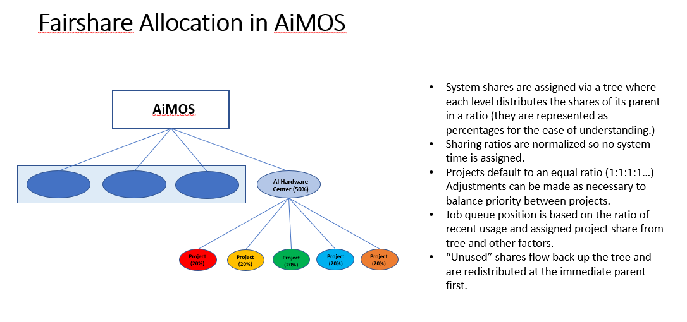
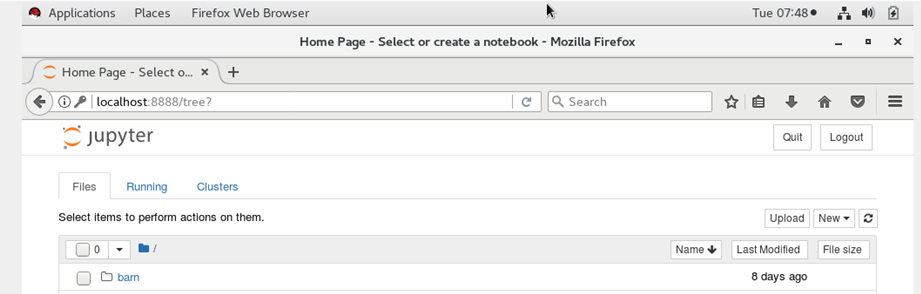
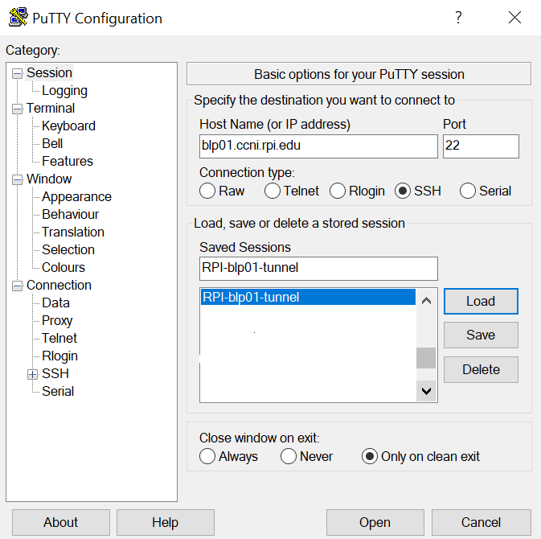
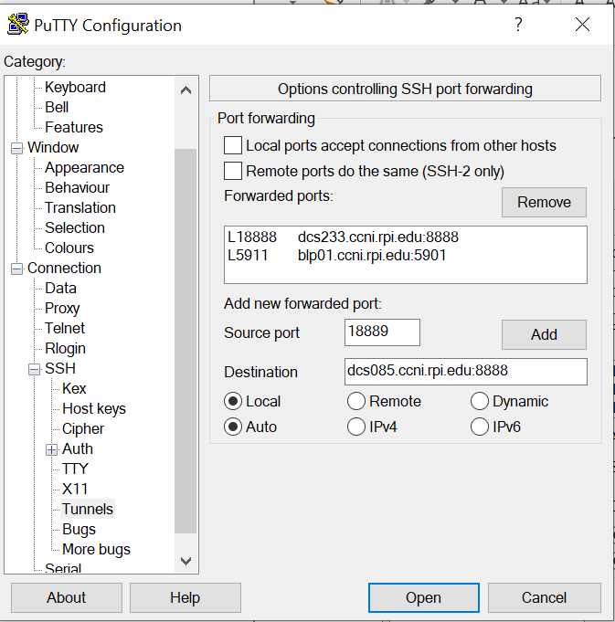
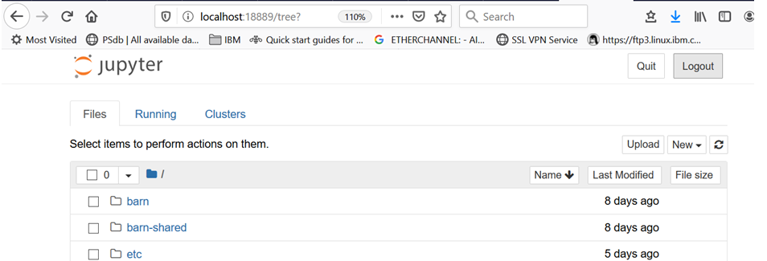

:toc: macro
:toc-title:
:toclevels: 99

# AiMOS On-Board Documentation

toc::[]

## What is AiMOS?
The IBM Research AI Hardware Center is a global research hub headquartered in Albany, New York. 
The center is focused on enabling next-generation chips and systems that support the tremendous processing power and 
unprecedented speed that AI requires to realize its full potential.  
AiMOS (short for **A**rtificial **I**ntelligence **M**ultiprocessing **O**ptimized **S**ystem) serves as the test bed for 
the IBM Research AI Hardware Center. AiMOS consists of 2 front end nodes and 252 AC922 compute nodes configured in a 14 rack system.

Each compute node has: 

* 2x 20 core POWER9 processors (Summit’s variant)
* 6x NVIDIA Volta V100 GPUs w/ 32 GB of HBM each
* 512 GB of DRAM
* 1.6 TB NVMe SSD storage
* Dual, 100 Gb/sec Mellanox IB links

AiMOS uses Slurm for resource management and scheduler tool.  The front end nodes are for developing applications or building the AI frameworks if needed as well as issuing SLURM commands to allocate the compute nodes for testing and running applications.

The following sections will provide you the basic steps to get you on-boarded to the AiMOS environment.  If you need any assistance, please post your questions to the https://ibm-research.slack.com/archives/CR271K4M7[aimos slack channel] or send email to kvtran@us.ibm.com and herger@us.ibm.com.

## How to apply for a user id on AiMOS?

You need to fill out the following forms, sign and send them to herger@us.ibm.com.

### CCI User Information  
https://secure.cci.rpi.edu/wiki/images/b/b1/CCI_User_Information_20140612.pdf

### CCI User Responsibility Agreement
https://secure.cci.rpi.edu/wiki/images/b/b3/CCI_User_Responsibility_Agreement_20140612.pdf

Once the forms are processed, you will receive emails from the system administrators at RPI for your account ID and temporary password. The next step is to <<set-your-password>>. 

### Set your password 
You will receive the link  similar to this, https://secure.cci.rpi.edu/password/?a=XXXXXXXXXXXXXXXX&b=1, where XXXXXXXXXXXXXXXX is your temporary password. You need to use the link to reset your password.

### Set the Challenge Word 
The next step is choose and set the Challenge Word: https://secure.cci.rpi.edu/challenge/

### Set the Personal Identification Code (PIC)
The last step is to choose the Personal Identification code (PIC). The PIC is case-sensitive and is made up of at least 4 numbers and/or letters. No special characters may be used. Do not use your bank PIN, account name, first or last name, or organization.

* Install "Google Authenticator" app on your mobil device
* Go to https://secure.cci.rpi.edu/totp
**  Enter your User ID, Password, the Challenge Word, the chosen PIC; Click Setup TOTP.
**  You will get  QR code.
* Go to the Google Authenticator app on your mobile device and scan the QR code.

You now have everything you need to login to a landing pad node.

## What is the landing pad nodes?

For more information see https://secure.cci.rpi.edu/wiki/index.php?title=Landing_pad

Landing pad nodes are nodes that have an external IP.  You will need to login to one of the landing pad nodes before you can access the AiMOS systems.

There are 4 landing pad nodes for AiMOS:

* blp01.ccni.rpi.edu
* blp02.ccni.rpi.edu
* blp03.ccni.rpi.edu 
* blp04.ccni.rpi.edu 

## What is the frond end node?

The front end nodes (a.k.a. login nodes) are nodes where you find Slurm, compilers, libraries, headers, development tools, etc.  This is where you build your executables if needed, issue Slurm commands to submit jobs.  In order to see some of the executables, libraries, etc., you may need to use module to load them first. For how to, please see section <<how-to-load-different-modules-for-your-development-and-testing>> section later in this documentation.

There are two front end nodes in AiMOS.

* dcsfen01.ccni.rpi.edu
* dcsfen02.ccni.rpi.edu

## What is the compute node?

Compute node is node where you execute your application.  There are 252 compute nodes in AiMOS.  They are AC922 with 6 GPU each. You can only log in to the compute nodes that are allocated to you via SLURM commands.

* dcs001.ccni.rpi.edu - dcs252.ccni.rpi.edu

## How to login to AiMOS?

The steps are ssh to a landing pad node, then from there ssh to a front end node for dcs cluster.

### ssh to a landing pad node

First you need to ssh to one of the landing pad nodes. For PIC+Token, enter your chosen PIC that you set above and the token from the Google Authenticator app on your mobile device.  Note, do not enter + and space.  For example:

....
$ ssh your-id@blp01.ccni.rpi.edu
PIC+Token:
Password:
Last login: Fri Mar  6 15:41:57 2020 from 70.113.9.236

               ** CCI SSH Gateway (Landing pad) **
**                                                             **
**     Please report all support and operation issues to       **
**     support@ccni.rpi.edu                                    **
**                                                             **
**     On-line documentation for the systems can be found at:  **
**     https://secure.cci.rpi.edu/wiki                         **
**                                                             **
**     CCI does not provide any data backup services. Users    **
**     are responsible for their own data management and       **
**     backup.                                                 **
**                                                             **
**     Use is subject to the terms of the policy for           **
**     Acceptable Use of CCI Resources.                        **
**                                                             **

....

### Set up passwordless 

**It is strongly recommended that you set up the passwordless to login to the front end nodes and compute nodes**.  This is particularly required if you are running MPI workload.  You only need to do this once. 

....
ssh-keygen -t rsa
cp ~/.ssh/id_rsa.pub ~/.ssh/authorized_keys
....

### ssh to a front end node

From the landing pad node, you ssh to the one of the front end nodes.  There are two front end nodes: dcsfen01 and dcsfen02.   For example: 

....
[your-id@blp01 ~]$ ssh dcsfen01
Last login: Fri Feb 28 11:43:56 2020 from 172.31.29.1

                   ** CCI DCS front-end node **
**                                                             **
**     Please report all support and operation issues to       **
**     support@ccni.rpi.edu                                    **
**                                                             **
**     On-line documentation for the systems can be found at:  **
**     https://secure.cci.rpi.edu/wiki                         **
**                                                             **
**     Use is subject to the terms of the policy for           **
**     Acceptable Use of CCI Resources.                        **
**                                                             **
....

### Set up proxy

You need to set up the proxy in order to access the internet.  However, RPI uses the white list to control which site is accessible. If the site is not accessible, you may want to download  and scp them over to the AiMOS environment if the files are small enough.  If that is not feasible, we can send a request to add the site to the white list. 

**It is strongly recommended that you set up the proxy by adding the following lines to your .bashrc**.  You only need to do this once.

....
export http_proxy=http://proxy:8888
export https_proxy=$http_proxy
....

Do not forget to source your .bashrc after you add the lines to the .bashrc for this to take effect.

## What is the disk space on the nodes?

The same GPFS filesystems are mounted on all the front end nodes and compute nodes in AiMOS.

This is the general user level filesystem view.
....
/gpfs
	/u
  		/home
   			/PROJ
    				/USER
						/barn
						/barn-shared
  						/scratch
						/scratch-shared
....

* Each user is allocated a 10 GiB quota which includes user's home, barn and barn-shared.  This space is intended for long term storage and it will be saved. 
* home directory contains a link to scratch, the user's personal scratch space.  It also contains a link to scratch-shared, the project's shared scratch space.
* scratch and scratch-shared are meant as a temporary staging area for performing computation. Performance in this directory will be better than in the home or barn areas. This space does not have a quota. However, it will periodically be purged of files that are not used (either by read or write operation) in the last 56 days.  WARNING: If purging files that are not used in the last 56 days is not  sufficient to maintain enough working space, the RPI team may purge all files with with advance warning.

Due to the total space of 10 GiB in home, barn and barn-shared, it is best to use these directories to store "dot files", configuration files, scripts, or small programs needed to customize the working environment. You should use scratch and scratch-shared for things that require more space.

## How is slurm workload manager configured in AiMOS environment?

Slurm (used to be Simple Linux Utility for Resource Management) is the cluster management and job scheduler for AiMOS. 

The fairshare allocation is used in the environment:

* Each key partner (e.g., IBM, RPI) is given a fixed slice of AiMOS expressed as a percentage of the whole system
Within a key partner’s “slice”, group projects are defined. 
* By default, each project gets a fair share of the overall partner level slice.
* Inside each project, users accounts are created. 
* By default, each user gets a fair share of the overall group project level slice

NOTE: You need to specify the time limit (-t <number of minutes>) on the SLURM command that you issue.  If not, you will get an error message for that.  The maximum time limit is set to 6 hours (360 mins) on AiMOS.

## What are the SLURM Frequently Used Commands?

For the complete list of SLURM manpage, see https://slurm.schedmd.com/man_index.html
 
For the summary for SLURM commands and options, see https://slurm.schedmd.com/pdfs/summary.pdf

The frequently used options for SLURM commands:

....
 -n, --ntasks=ntasks         number of tasks to run
 -N, --nodes=N               number of nodes on which to run (N = min[-max])
 -c, --cpus-per-task=ncpus   number of cpus required per task
     --ntasks-per-node=n     number of tasks to invoke on each node
 -i, --input=in              file for batch script's standard input
 -o, --output=out            file for batch script's standard output
 -e, --error=err             file for batch script's standard error
 -p, --partition=partition   partition requested
 -t, --time=minutes          time limit
 -D, --chdir=path            change remote current working directory
 -D, --workdir=directory     set working directory for batch script
     --mail-type=type        notify on state change: BEGIN, END, FAIL or ALL
     --mail-user=user        who to send email notification for job state changes
....

*salloc* – allocate resources for a job in real time and start a shell.

....
[your-id@dcsfen01 ~]$  salloc -N 1 --gres=gpu:6 -t 15
salloc: Granted job allocation 60780
....

*squeue* – reports the state of jobs or job step. By default, it reports the running jobs in priority order and then the pending jobs in priority order.

....
[your-id@dcsfen01 ~]$ squeue
             JOBID PARTITION     NAME     USER ST       TIME  NODES NODELIST(REASON)
             60780       dcs     bash your-id  R       1:07      1 dcs249
[your-id@dcsfen01 ~]$ ssh dcs249
Warning: Permanently added 'dcs249,172.31.236.249' (ECDSA) to the list of known hosts.
....

To display when your pending job would be started:

....
[your-id@dcsfen01 ~]$ squeue --start
             JOBID PARTITION     NAME     USER ST          START_TIME  NODES SCHEDNODES           NODELIST(REASON)
             93765   dcs,rpi pytorch_ your-id  PD 2020-03-27T12:34:38      2 dcs[235-236]         (Resources)
....

*srun* – submits a job for execution or initiates job steps in real time.

*sattach* – attach standard input, output, error and signal capabilities to a current running job or job step.

*sbatch* – submit a job script for later execution. The script typically contains one or more srun commands to launch parallel tasks.

....
sbatch ./batch-job.sh
....

*scancel* – cancel a pending or running job or job step.

....
 scancel <JOBID>
....

*sinfo* – reports the state of partitions and nodes managed by Slurm.

....
[your-id@dcs249 ~]$ sinfo
PARTITION AVAIL  TIMELIMIT  NODES  STATE NODELIST
debug        up      30:00      5 drain* dcs[213,253-254,266],dcsfen02
debug        up      30:00     11  down* dcs[040,074,109,119,121,124,126,168-169,173,270]
debug        up      30:00     20  drain dcs[026,068,086,154,194,199,206,209-211,216,236,242,246,250,255,257,259-260,269]
debug        up      30:00     78  alloc dcs[023-025,027-030,032-036,039,069-073,110-118,120,125,165,170-172,174-193,198,200-205,212,237-241,243-245,247-249,256,261-265]
debug        up      30:00    136   idle dcs[001-012,014-022,037-038,041-067,075-085,087-108,122-123,127-153,155-164,166-167,195-196,207-208,214-215,235,251-252,258,267-268]
debug        up      30:00      3   down dcs[013,031,197]
dcs          up    6:00:00      4 drain* dcs[213,253-254,266]
dcs          up    6:00:00     11  down* dcs[040,074,109,119,121,124,126,168-169,173,270]
dcs          up    6:00:00     20  drain dcs[026,068,086,154,194,199,206,209-211,216,236,242,246,250,255,257,259-260,269]
dcs          up    6:00:00     78  alloc dcs[023-025,027-030,032-036,039,069-073,110-118,120,125,165,170-172,174-193,198,200-205,212,237-241,243-245,247-249,256,261-265]
dcs          up    6:00:00    136   idle dcs[001-012,014-022,037-038,041-067,075-085,087-108,122-123,127-153,155-164,166-167,195-196,207-208,214-215,235,251-252,258,267-268]
dcs          up    6:00:00      3   down dcs[013,031,197]
rpi          up    6:00:00      1 drain* dcs218
rpi          up    6:00:00     13  drain dcs[217,219-222,224-229,231-232]
rpi          up    6:00:00      2  alloc dcs[223,230]
....

## How to submit an interactive job via Slurm?

For example, after ssh to one of the front end nodes, run *salloc* to allocate 1 node with 6 gpu for 15 minutes. After the command returns, you now run *squeue* command to see which node is allocated for the interactive session.  In the example below, dcs249 is allocated.  Now you can ssh to the node and execute your application.  

....
[your-id@dcsfen01 ~]$  salloc -N 1 --gres=gpu:6 -t 15
salloc: Granted job allocation 60780
[your-id@dcsfen01 ~]$ squeue
             JOBID PARTITION     NAME     USER ST       TIME  NODES NODELIST(REASON)
             60780       dcs     bash your-id  R       1:07      1 dcs249
[your-id@dcsfen01 ~]$ ssh dcs249
Warning: Permanently added 'dcs249,172.31.236.249' (ECDSA) to the list of known hosts.
[your-id@dcs249 ~]$ ls
barn  barn-shared  etc  Miniconda3-latest-Linux-ppc64le.sh  scratch  scratch-shared  var
[your-id@dcs249 ~]$ hostname -f
dcs249.ccni.rpi.edu
....

After the specified time, which is 15 minutes in this example, the node is deallocated and you will no longer be allowed to ssh to the node.

....
[your-id@dcs249 ~]$ salloc: Job 60780 has exceeded its time limit and its allocation has been revoked.
   Killed by signal 1.
[your-id@dcsfen01 ~]$ ssh dcs249
Access denied: user yourid (uid=6112) has no active jobs on this node.
Access denied by pam_slurm_adopt: you have no active jobs on this node
Authentication failed.
....

## How to submit a batch job via SLURM?

You need to create a script to submit via *sbatch* Slurm command. The script contains a list of SLURM directives (or commands) to tell Slurm what to do. This is a sample script to run a hello_MPI_c program.

IMPORTANT: Passwordless is required for MPI job.  See <<set-up-passwordless>> for how to.

....
#!/bin/bash -x

# The lines started with SBATCH are directives to sbatch command.  Alternately, they can be specified on the command line.
#SBATCH -J hello_MPI
#SBATCH -o hello_MPI_%j.out
#SBATCH -e hello_MPI_%j.err
#SBATCH --mail-type=ALL
#SBATCH --mail-user=<you email address>
#SBATCH --gres=gpu:6
#SBATCH --nodes=1
#SBATCH --ntasks-per-node=4
#SBATCH --time=02:00:00

# SLURM_NPROCS and SLURM_NTASK_PER_NODE env variables are set by sbatch Slurm commands based on the SBATCH directives above 
# or options specified on the command line.
if [ "x$SLURM_NPROCS" = "x" ]
then
  if [ "x$SLURM_NTASKS_PER_NODE" = "x" ]
  then
    SLURM_NTASKS_PER_NODE=1
  fi
  SLURM_NPROCS=`expr $SLURM_JOB_NUM_NODES \* $SLURM_NTASKS_PER_NODE`
else
  if [ "x$SLURM_NTASKS_PER_NODE" = "x" ]
  then
    SLURM_NTASKS_PER_NODE=`expr $SLURM_NPROCS / $SLURM_JOB_NUM_NODES`
  fi
fi

# Get the host name of the allocated compute node(s) and generate the host list file.
srun hostname -s | sort -u > ~/tmp/hosts.$SLURM_JOBID
awk "{ print \$0 \"-ib slots=$SLURM_NTASKS_PER_NODE\"; }" ~/tmp/hosts.$SLURM_JOBID >~/tmp/tmp.$SLURM_JOBID
mv ~/tmp/tmp.$SLURM_JOBID ~/tmp/hosts.$SLURM_JOBID

# Load the required tools and libraries for the job.
module load gcc/6.4.0/1
module load spectrum-mpi

# Submit the job.
mpirun --bind-to core --report-bindings -hostfile ~/tmp/hosts.$SLURM_JOBID -np $SLURM_NPROCS <PATH>/hello_MPI_c

# Remove the generated host list file
rm ~/tmp/hosts.$SLURM_JOBID
....

Submit the job via sbatch

....
sbatch ./hello_MPI.sh
....

Note: that you can specify the command options on the *sbatch* command line instead of using #SBATCH directive like in the sample script above.

With #SBATCH --mail-type=ALL, #SBATCH --mail-user=<you email address>, you should receive the email from SLURM when a job starts and ends to your email address.

You should also see the <job name>_<job_id>.out and <job name>_<job_id>.err in your current directory with #SBATCH -o hello_MPI_%j.out and #SBATCH -e hello_MPI_%j.err after the job completes.

## How to install conda environment?

IMPORTANT: Make sure that you set up the proxy before you proceed to the next step.  See <<set-up-proxy>> for how to.

Download the the Miniconda3 installer if needed.
....
wget https://repo.anaconda.com/miniconda/Miniconda3-latest-Linux-ppc64le.sh
....

Install the miniconda environment to scratch directory.

....
[BMHRkmkh@dcsfen01 ~]$ bash Miniconda3-latest-Linux-ppc64le.sh -p ~/scratch/miniconda3

Welcome to Miniconda3 4.7.12

In order to continue the installation process, please review the license
agreement.
Please, press ENTER to continue
>>>
...
Do you accept the license terms? [yes|no]
[no] >>> yes

Miniconda3 will now be installed into this location:
/gpfs/u/home/BMHR/BMHRkmkh/scratch/miniconda3

  - Press ENTER to confirm the location
  - Press CTRL-C to abort the installation
  - Or specify a different location below

[/gpfs/u/home/BMHR/BMHRkmkh/scratch/miniconda3] >>>
PREFIX=/gpfs/u/home/BMHR/BMHRkmkh/scratch/miniconda3
Unpacking payload ...
Collecting package metadata (current_repodata.json): done
Solving environment: done

## Package Plan ##

  environment location: /gpfs/u/home/BMHR/BMHRkmkh/scratch/miniconda3

  added / updated specs:
    - _libgcc_mutex==0.1=main
    - asn1crypto==1.2.0=py37_0
    - ca-certificates==2019.10.16=0
...
  yaml               pkgs/main/linux-ppc64le::yaml-0.1.7-h1bed415_2
  zlib               pkgs/main/linux-ppc64le::zlib-1.2.11-h7b6447c_3

Preparing transaction: done
Executing transaction: done
installation finished.
Do you wish the installer to initialize Miniconda3
by running conda init? [yes|no]
[no] >>> yes
no change     /gpfs/u/home/BMHR/BMHRkmkh/scratch/miniconda3/condabin/conda
no change     /gpfs/u/home/BMHR/BMHRkmkh/scratch/miniconda3/bin/conda
no change     /gpfs/u/home/BMHR/BMHRkmkh/scratch/miniconda3/bin/conda-env
no change     /gpfs/u/home/BMHR/BMHRkmkh/scratch/miniconda3/bin/activate
no change     /gpfs/u/home/BMHR/BMHRkmkh/scratch/miniconda3/bin/deactivate
no change     /gpfs/u/home/BMHR/BMHRkmkh/scratch/miniconda3/etc/profile.d/conda.sh
no change     /gpfs/u/home/BMHR/BMHRkmkh/scratch/miniconda3/etc/fish/conf.d/conda.fish
no change     /gpfs/u/home/BMHR/BMHRkmkh/scratch/miniconda3/shell/condabin/Conda.psm1
no change     /gpfs/u/home/BMHR/BMHRkmkh/scratch/miniconda3/shell/condabin/conda-hook.ps1
no change     /gpfs/u/home/BMHR/BMHRkmkh/scratch/miniconda3/lib/python3.7/site-packages/xontrib/conda.xsh
no change     /gpfs/u/home/BMHR/BMHRkmkh/scratch/miniconda3/etc/profile.d/conda.csh
modified      /gpfs/u/home/BMHR/BMHRkmkh/.bashrc

==> For changes to take effect, close and re-open your current shell. <==

If you'd prefer that conda's base environment not be activated on startup,
   set the auto_activate_base parameter to false:

conda config --set auto_activate_base false

Thank you for installing Miniconda3!
[your-id@dcsfen01 ~]$
[your-id@dcsfen01 ~]$ source .bashrc
(base) [your-idh@dcsfen01 ~]$
....

## How to install WML-CE (a.k.a PowerAI)?

Watson Machine Learning Community Edition (WML CE), formerly PowerAI, is a free, enterprise-grade software distribution that combines popular open source deep learning frameworks, efficient AI development tools, and accelerated IBM® Power Systems™ servers to take your deep learning projects to the next level.  

For more information, see
https://developer.ibm.com/linuxonpower/deep-learning-powerai/releases/

IMPORTANT: Make sure that you set up the proxy before you proceed to the next step.  See <<set-up-proxy>> for how to.

Set up ~/.condarc if needed.  Below is the example of .condarc file. You need replace *your-project* with your PROJECT ID and *your-id" with your ID.

....
pkgs_dirs:
  - /gpfs/u/software/ppc64le-rhel7/.conda/pkgs
  - /gpfs/u/home/your-project/your-id/scratch/miniconda3/pkgs
  - /gpfs/u/home/your-project/your-id/.conda/pkgs
channels:
  - https://public.dhe.ibm.com/ibmdl/export/pub/software/server/ibm-ai/conda
  - defaults
....

As a best practice, you should install WML-CE in a new conda environment (i.e. not the base environment).  That would enable you to have different versions of WML-CE.

For more information on how to install WML-CE, see https://www.ibm.com/support/knowledgecenter/SS5SF7_1.7.0/navigation/wmlce_install.htm

Create a new conda environment wmlce-1.7.0 using python version 3.6.

....
conda create --name wmlce-1.7.0 python=3.6
....

Activate the created conda environment.

....
conda activate wmlce-1.7.0
....

Install WML-CE version 1.7.0 which is the latest version at the time of this writting. 

For automatically accept the license

....
export IBM_POWERAI_LICENSE_ACCEPT=yes
....

* To install the whole powerai GPU packages in the created conda environment, run:

....
conda install powerai
....

* To install the whole powerai GPU packages version 1.6.2

....
conda install powerai=1.6.2
....

* To install the individual framework, such as pytorch or tensorflow.  

For complete list of individual framework see https://www.ibm.com/support/knowledgecenter/SS5SF7_1.7.0/navigation/wmlce_install.htm

....
conda install pytorch
conda install tensorflow-gpu
....

* To install powerai CPU packages in the created conda environment, run:

....
conda install powerai-cpu
....

* To install RAPIDS packages, run:

....
conda install powerai-rapids
.... 

## How to load different modules for your development and testing?

List the available modules on the node:

....
(base) [your-id@dcsfen01 ~]$ module available

------------------------------- /gpfs/u/software/ppc64le-rhel7/modulefiles --------------------------------
   automake/1.16.1 (S)      cmake/3.14.6  (S)    parmetis/4.0.3/xl (T)      xl/1
6.1.1
   bazel/0.17.2/1  (T)      gcc/6.4.0/1          pocl/1.2/1        (T)      xl_r/13     (
O)
   bazel/0.18.1/1  (T,D)    gcc/6.5.0/1          spectrum-mpi/10.3 (T)      xl_r/16     (
T,D)
   bazel/0.18.0/1  (T)      gcc/7.4.0/1          swig/3.0.12_1     (T)      xl_r/16.1.1
   bazel/0.21.0/1  (T)      gcc/8.1.0/1          valgrind/3.15.0   (S)
   ccache/3.5/1    (T)      gcc/8.2.0/1   (D)    xl/13             (O)
   clang/7.0.0/1   (T)      hwloc/2.0.2/1 (T)    xl/16             (T,D)

  Where:
   O:  Obsolete
   T:  Testing
   S:  Stable
   D:  Default Module

Module defaults are chosen based on Find First Rules due to Name/Version/Version modules found in the modul
e tree.
See https://lmod.readthedocs.io/en/latest/060_locating.html for details.

Use "module spider" to find all possible modules and extensions.
Use "module keyword key1 key2 ..." to search for all possible modules matching any of the "keys".

....

For example, you want to load cmake module and spectrum_mpi module

....
(base) [your-id@dcsfen01 ~]$ module load  cmake/3.14.6
(base) [your-id@dcsfen01 ~]$ which cmake
alias cmake='cmake3'
        /usr/bin/cmake3
(base) [your-id@dcsfen01 ~]$ which cmake3
/usr/bin/cmake3
(base) [your-id@dcsfen01 ~]$ module load spectrum-mpi
(base) [your-id@dcsfen01 ~]$ which mpirun
/opt/ibm/spectrum_mpi/bin/mpirun

....

## How to install Jupyter notebook?

IMPORTANT: Make sure that you set up the proxy before you proceed to the next step.  See <<set-up-proxy>> for how to.

It is recommended to link:https://jupyter.org/install.html[install Jupyter notebook] in a miniconda environment which includes a minimal Python and conda installation.  You can install Jupyter notebook via conda install or pip install.

If you plan to use the AI framework with your notebook, make sure that you install Jupyter notebook in the conda environment that includes the AI framework.  For example, if you want to use the AI frameworks that are included in the WML-CE, then you need to install Jupyter notebook in the environment that WML-CE was installed.

....
conda install -c conda-forge notebook
....

Or

....
pip install notebook
....

For example:

....
(base) [your-id@dcsfen01 wmlce-1.7.0]$ conda install -c conda-forge notebook
Collecting package metadata (current_repodata.json): done
Solving environment: done

## Package Plan ##

  environment location: /gpfs/u/home/BMHR/BMHRkmkh/scratch/miniconda3

  added / updated specs:
    - notebook

The following packages will be downloaded:

    package                    |            build
....

Verify the notebook  installation.

....
(base) [your-id@dcsfen01 wmlce-1.7.0]$ conda list | grep notebook
notebook                  6.0.3                    py37_0    conda-forge
....

## How to display the WebGUI for a jupyter notebook running on a compute node via ssh tunnelling?

### Prerequisites

conda and jupyter notebook are installed on the node. For how to see <<how-to-install-conda-environment>> and <<how-to-install-jupyter-notebook>>

### Start the jupyter notebook on the allocated compute node 

In the following example, starting jupyter notebook on dcs085.

....
(wmlce-1.7.0) [your-id@dcs085 ~]$ jupyter notebook --ip=0.0.0.0 --no-browser
....

### SSH tunnelling on a Linux or MAC OSX node

Start the ssh session to one of the landing pad nodes.  For example:

....
[id@kvt-rhel ~]$ ssh -L8888:dcs085:8888 BMHRkmkh@blp01.ccni.rpi.edu
....

Go to the browser on the node, enter the following to tunnel to the jupyter notebook running on the compute node.

....
http://localhost:8888
....

You should see the jupyter notebook after you enter the token at the login prompt.

### SSH tunneling via PUTTY on Windows

Go to the putty entry for the landing pad node.  For example:

Go section Connection->SSH->Tunnels, enter the jupyter notebok URL on the compute node and click *Add*, for example:

Start the putty session and login to the landing node as usual.  

After that, go to your browser and enter the following to tunnel to the jupyter notebook running on the compute node.

....
http://localhost:18889
....

You should see the jupyter notebook after you enter the token at the login prompt.

## How to transfer data in and out of AiMOS environment?

You need to use scp to copy data from/to your laptop/desktop to/from one of the landing pad nodes. Since the same gpfs file system is mounted on the landing pad nodes, front end nodes and compute nodes, the data will be available and accessible on all the nodes.

....
$ scp multigpu_basic*.ipynb your-id@blp01.ccni.rpi.edu:~/scratch-shared/jupyter-notebooks
PIC+Token:
Password:
multigpu_basic.ipynb                                                                   100% 6330    79.3KB/s   00:00
multigpu_basics.ipynb                                                                  100% 4258    55.0KB/s   00:00
....

If your desktop/laptop is running Windows, you use winscp to do the copy.

NOTE: You MUST initiate the copy operation from your desktop/laptop.

## How to request for NVMe storage on the compute nodes?

To request NVMe storage, specify --gres=nvme with your SLURM commands. This can be combined with other requests, such as GPUs. When the first job step starts, the system will initialize the storage and create the path /mnt/nvme/uid_${SLURM_JOB_UID}/job_${SLURM_JOBID}.

....
(base) [your-id@dcsfen01 ~]$  salloc -N 1 --gres=gpu:6 --gres=nvme -t 30
salloc: Granted job allocation 64444
(base) [your-id@dcsfen01 ~]$ squeue
             JOBID PARTITION     NAME     USER ST       TIME  NODES NODELIST(REASON)
             64444       dcs     bash BMHRkmkh  R       0:11      1 dcs055
(base) [your-id@dcsfen01 ~]$ ssh dcs055
Warning: Permanently added 'dcs055,172.31.236.55' (ECDSA) to the list of known hosts.
(base) [your-id@dcs055 ~]$
(base) [your-id@dcs055 ~]$ df -h
Filesystem      Size  Used Avail Use% Mounted on
devtmpfs        243G     0  243G   0% /dev
tmpfs           256G   64K  256G   1% /dev/shm
tmpfs           256G   25M  256G   1% /run
tmpfs           256G     0  256G   0% /sys/fs/cgroup
rootfs          256G  7.6G  249G   3% /
rw              256G   64K  256G   1% /.sllocal/log
gpfs.u          1.1P  387T  640T  38% /gpfs/u
/dev/nvme0n1    1.5T   77M  1.5T   1% /mnt/nvme
(base) [your-id@dcs055 job_64444]$ pwd
/mnt/nvme/uid_6112/job_64444
....

NOTE: The NVMe storage is not persistent between allocations.

