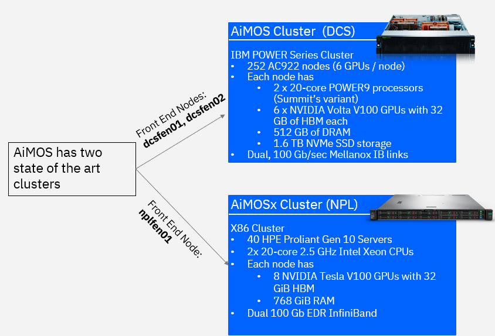

Submit jobs
===========

You use Slurm commands to submit jobs to AiMOS.  

Prerequisites
^^^^^^^^^^^^^

* You logged in to one of the front end nodes.  For how to see :ref:`how-to-login`.

* You must specify "--gres=gpu:<value>" option with the **salloc** or **sbatch** command if you want to allocate the compute nodes from AiMOS.  

   * The value is between 1 and 6 for DCS(Power) cluster. 

   * The value is between  1 and 8 for NPL(X86) cluster.

* This the number of gpu that you want per node.  If you specify --gres=gpu:6 for DCS cluster or --gres=gpu:8 for NPL cluster, you are in essence would get the whole node(s) allocated to you.  For more information regarding GPU on AiMOS, see https://secure.cci.rpi.edu/wiki/clusters/DCS_Supercomputer/#using-gpus.

* You also must specify the time required to run your job via option **-t <value>**.  The value is number of minutes. See :ref:`job-queue` for more information. 
  

Interactive Job
^^^^^^^^^^^^^^^

It is assumed that you already ssh to one of the front end nodes.  You use the **salloc** command to allocate 1 node with 6 gpu for 15 minutes. After the command returns, you now run squeue command to see which node is allocated for the interactive session. In the example below, dcs249 is allocated. Now you can ssh to the node and execute your application.

.. code:: bash

  [your-id@dcsfen01 ~]$  salloc -N 1 --gres=gpu:6 -t 15
  salloc: Granted job allocation 60780
  [your-id@dcsfen01 ~]$ squeue
               JOBID PARTITION     NAME     USER ST       TIME  NODES NODELIST(REASON)
               60780       dcs     bash your-id  R       1:07      1 dcs249
  [your-id@dcsfen01 ~]$ ssh dcs249
  Warning: Permanently added 'dcs249,172.31.236.249' (ECDSA) to the list of known hosts.
  [your-id@dcs249 ~]$ ls
  barn  barn-shared  etc  Miniconda3-latest-Linux-ppc64le.sh  scratch  scratch-shared  var
  [your-id@dcs249 ~]$ hostname -f
  dcs249.ccni.rpi.edu

After the specified time, which is 15 minutes in this example, the node is deallocated and you will no longer be allowed to ssh to the node.

.. code:: bash

  [your-id@dcs249 ~]$ salloc: Job 60780 has exceeded its time limit and its allocation has been revoked.
     Killed by signal 1.
  [your-id@dcsfen01 ~]$ ssh dcs249
  Access denied: user yourid (uid=6112) has no active jobs on this node.
  Access denied by pam_slurm_adopt: you have no active jobs on this node
  Authentication failed.

Batch job
^^^^^^^^^

You use **sbatch** Slurm command to submit a batch job.  You can create a scriptthat contains a list of Slurm directives (or commands) to tell Slurm what to do. This is a sample script to run a hello_MPI_c program.

**PREREQUISITE:** Passwordless is required for MPI job.  For how to see :ref:`setup-environment`.

.. code:: bash

  #!/bin/bash -x
  
  # The lines started with SBATCH are directives to sbatch command.  Alternately, they can be specified on the command line.
  #SBATCH -J hello_MPI
  #SBATCH -o hello_MPI_%j.out
  #SBATCH -e hello_MPI_%j.err
  #SBATCH --mail-type=ALL
  #SBATCH --mail-user=<you email address>
  #SBATCH --gres=gpu:6
  #SBATCH --nodes=1
  #SBATCH --ntasks-per-node=4
  #SBATCH --time=02:00:00

  # SLURM_NPROCS and SLURM_NTASK_PER_NODE env variables are set by sbatch Slurm commands based on the SBATCH directives above
  # or options specified on the command line.
  if [ "x$SLURM_NPROCS" = "x" ]
  then
    if [ "x$SLURM_NTASKS_PER_NODE" = "x" ]
    then
      SLURM_NTASKS_PER_NODE=1
    fi
    SLURM_NPROCS=`expr $SLURM_JOB_NUM_NODES \* $SLURM_NTASKS_PER_NODE`
  else
    if [ "x$SLURM_NTASKS_PER_NODE" = "x" ]
    then
      SLURM_NTASKS_PER_NODE=`expr $SLURM_NPROCS / $SLURM_JOB_NUM_NODES`
    fi
  fi
  
  # Get the host name of the allocated compute node(s) and generate the host list file.
  srun hostname -s | sort -u > ~/tmp/hosts.$SLURM_JOBID
  awk "{ print \$0 \"-ib slots=$SLURM_NTASKS_PER_NODE\"; }" ~/tmp/hosts.$SLURM_JOBID >~/tmp/tmp.$SLURM_JOBID
  mv ~/tmp/tmp.$SLURM_JOBID ~/tmp/hosts.$SLURM_JOBID
  
  # Load the required tools and libraries for the job.
  module load gcc/6.4.0/1
  module load spectrum-mpi

  # Submit the job.
  mpirun --bind-to core --report-bindings -hostfile ~/tmp/hosts.$SLURM_JOBID -np $SLURM_NPROCS <PATH>/hello_MPI_c
  
  # Remove the generated host list file
  rm ~/tmp/hosts.$SLURM_JOBID

Submit the  above sample job via **sbatch** command:

.. code:: bash

  sbatch ./hello_MPI.sh

Note: that you can specify the command options on the **sbatch** command line instead of using #SBATCH directive like in the sample script above.

With #SBATCH --mail-type=ALL, #SBATCH --mail-user=<you email address>, you should receive the email from Slurm when a job starts and ends to your email address.

You should also see the <job name>_<job_id>.out and <job name>_<job_id>.err in your current directory with #SBATCH -o <job name>_%j.out and #SBATCH -e <job name>_%j.err after the job completes.

Request for up to 48 hours run time
^^^^^^^^^^^^^^^^^^^^^^^^^^^^^^^^^^^

DCS cluster now has a capability for a 48 hour job time limit.  This option is not available on the NPL cluster.  There are maximum 18 nodes available for the 48 hour time limit. To request this capability, you must include the following line in your salloc or sbatch command.

.. code:: bash
  
   --qos=dcs-48hr

Or the following line in your batch script:

.. code:: bash

   #SBATCH --qos=dcs-48hr

.. _request-nvme:

Request for NVMe storage on the compute nodes
^^^^^^^^^^^^^^^^^^^^^^^^^^^^^^^^^^^^^^^^^^^^^

**NOTE:** NVMe storage is only available on the DCS cluster.  It is not yet available on the NPL cluster.

To request NVMe storage, specify --gres=nvme with your Slurm commands. This can be combined with other requests, such as GPUs. When the first job step starts, the system will initialize the storage and create the path /mnt/nvme/uid_${SLURM_JOB_UID}/job_${SLURM_JOBID}.

.. code:: bash

  (base) [your-id@dcsfen01 ~]$  salloc -N 1 --gres=gpu:6 --gres=nvme -t 30
  salloc: Granted job allocation 64444
  (base) [your-id@dcsfen01 ~]$ squeue
               JOBID PARTITION     NAME     USER ST       TIME  NODES NODELIST(REASON)
               64444       dcs     bash BMHRkmkh  R       0:11      1 dcs055
  (base) [your-id@dcsfen01 ~]$ ssh dcs055
  Warning: Permanently added 'dcs055,172.31.236.55' (ECDSA) to the list of known hosts.
  (base) [your-id@dcs055 ~]$
  (base) [your-id@dcs055 ~]$ df -h
  Filesystem      Size  Used Avail Use% Mounted on
  devtmpfs        243G     0  243G   0% /dev
  tmpfs           256G   64K  256G   1% /dev/shm
  tmpfs           256G   25M  256G   1% /run
  tmpfs           256G     0  256G   0% /sys/fs/cgroup
  rootfs          256G  7.6G  249G   3% /
  rw              256G   64K  256G   1% /.sllocal/log
  gpfs.u          1.1P  387T  640T  38% /gpfs/u
  /dev/nvme0n1    1.5T   77M  1.5T   1% /mnt/nvme
  (base) [your-id@dcs055 job_64444]$ pwd
  /mnt/nvme/uid_6112/job_64444

**NOTE:** The NVMe storage is not persistent between allocations.
