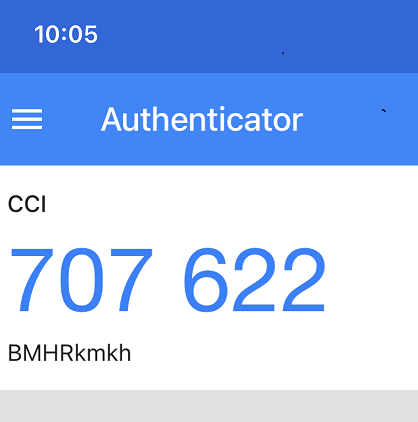

.. _access-aimos:

Access to AiMOS
===============

This section describes the steps for you to apply for a user ID and the process for log in to AiMOS. Access to AiMOS is limited to AI Hardware center members and partners.

.. _get-user-id-section:

Apply for a user ID on AiMOS
^^^^^^^^^^^^^^^^^^^^^^^^^^^^

**IMPORTANT:** Please include your **first name initial** and **last name** in the name of all files that you send to Lorraine Herger.  For example:

   - **CCI_User_Information_KTran**.pdf
   - **CCI_User_Responsibility_Agreement_KTran**.pdf

* If you are a first time user, you need to fill out the following forms, sign and send them to herger@us.ibm.com.  Also, provide the following:

  * If you are joining an existing project, please provide the 4 letter ID of the project, and the approval of the project leader/ PI.  CC'ing the PI on the email is sufficient.
  * If you are requesting a new project, then provide the following information in your email, along with your two completed forms:

      - Project Title:
      - Short Project Description:

* If you already have an AiMOS ID, and are requesting access to an existing project, only provide the following:

  * Your current AiMOS user ID.
  * 4 letter ID of the project you wish to join.
  * Approval of the project lead / PI to join the project.  CC'ing the PI on the email is sufficient.  For example:

::
  
  To: herger@us.ibm.com
  cc: <PI email id>
  Subject: Add existing users to another project

  USER ID: BMHRxxxx, SROMxxxx
  PROJECT ID: CADS, ADCS

CCI User Information
++++++++++++++++++++

https://secure.cci.rpi.edu/wiki/assets/forms/CCI_User_Information.pdf

CCI User Responsibility Agreement
+++++++++++++++++++++++++++++++++

https://secure.cci.rpi.edu/wiki/assets/forms/CCI_User_Responsibility_Agreement.pdf

**IMPORTANT:** Please include your **first name initial** and **last name** in the name of all files that you send to Lorraine Herger.  For example:

* **CCI_User_Information_KTran**.pdf 
* **CCI_User_Responsibility_Agreement_KTran**.pdf

Once the forms are processed, you will receive emails from **HPCman <hpcman@ccni.rpi.edu>** for your account ID and password reset token. The next step is to :ref:`set-password`.

**IMPORTANT:** You have 24 hours to reset your password.  If you miss it, you need to send an email to support@ccni.rpi.edu to request a new password reset token.

.. _set-password:

Set your password
+++++++++++++++++

You will receive the link similar to this, https://secure.cci.rpi.edu/password/?a=XXXXXXXXXXXXXXXX, where XXXXXXXXXXXXXXXX is your reset token. You need to use the link to reset your password. Please note that you have 24 hours to reset your password after you receive the email. If you miss it, you need to send an email to support@ccni.rpi.edu to request for a new password reset token.  After reset the password, the next step is to :ref:`set-challenge`.

.. _set-challenge:

Set the Challenge Word
++++++++++++++++++++++

The next step is choose and set the Challenge Word: https://secure.cci.rpi.edu/challenge/

Enter your User ID, your newly reset password, and the challenge word twice, then click "Set Challenge Word".  You are ready for the next step :ref:`set-pic`.

.. _set-pic:

Set the Personal Identification Code (PIC)
++++++++++++++++++++++++++++++++++++++++++

The last step is to choose the Personal Identification code (PIC). The PIC is case-sensitive and is made up of at least 4 numbers and/or letters. No special characters may be used. Do not use your bank PIN, account name, first or last name, or organization.

* Install "Google Authenticator" app on your mobile device.

* Go to https://secure.cci.rpi.edu/totp.

    * Enter your User ID, the Password, the Challenge Word, the chosen PIC, then "Click Setup TOTP".
    * You will get a QR code on the webpage.

* Go to the Google Authenticator app on your mobile device and scan the QR code.

You now have everything you need to login to a landing pad node.

.. _Re_Activate_User_Account:

Re-activate User Account
++++++++++++++++++++++++

Users need to re-activate their account in one of the following scenarios

**Re-activate Account**

* Deactivated account.  A user account will be deactivated after 3 months without using.

Step 1) Send an email to support@ccni.rpi.edu to request for a new password reset token.

Step 2) Set the Challenge Word

Step 3) Set the PIC. Reinstall "Google Authenticator" if changed a new phone.

**Changing a New Phone**

Google Authenticator needs to rescan the 2D bar code after new app installed. Here are the steps when after you switching to a new phone.

Step 1) Send an email to support@ccni.rpi.edu to request setup new TOTP (Time-based One-time Password) by providing you user ID, exmaple BMHRxxxx

Step 2) Support will send you an email after they removing the old two factor on your account. 

Step 3) You can now set it up again at https://secure.cci.rpi.edu/wiki/other/totp/. Providing your password, challange word, it will generat a new 2D bar code if password and challange word are accepted. Now you can scan it using your Google Authenticator app. 

.. figure:: TOTP.jpg

.. _Join_AiMOS_Slack_Channel:

Join aimos slack channel
++++++++++++++++++++++++

**IMPORTANT:**  Do not forget to join the aimos slack channel for information, questions and answers. Here are the list of the aimos slack channels:

* #aimos for IBM Researchers.

* #aimos_cleveland_clinic-guest

* #aimos_kla-guest

* #aimos_tel-guest

* #aimos_synopsys-guest

All IBM users who are not in the IBM Research Division, or users who are external to IBM,  will need to send a request to join email to Lorraine Herger (herger@us.bm.com).

.. _how-to-login:

Login to AiMOS
^^^^^^^^^^^^^^

The assumption is that you have already obtained your user ID for AiMOS.  If that is not the case,  please see :ref:`get-user-id-section`.

The steps are ssh to one of the landing pad nodes, then from there ssh to one of the front end nodes.  For the list of the landing pad nodes and front end nodes, please see :ref:`what-is-aimos`

ssh to a landing pad node
+++++++++++++++++++++++++

First you need to ssh to one of the landing pad nodes. There are four(4) landing pad nodes: 

* blp01.ccni.rpi.edu
* blp02.ccni.rpi.edu
* blp03.ccni.rpi.edu
* blp04.ccni.rpi.edu. 

For PIC+Token, enter your chosen PIC that you have set in the previous step and the token from the Google Authenticator app on your mobile device. For example: 

**Note:** do not enter + and space.  

For example:

::

  $ ssh your-id@blp01.ccni.rpi.edu
  PIC+Token:
  Password:
  Last login: Fri Mar  6 15:41:57 2020 from 70.113.9.236
  
               ** CCI SSH Gateway (Landing pad) **
  **                                                             **
  **     Please report all support and operation issues to       **
  **     support@ccni.rpi.edu                                    **
  **                                                             **
  **     On-line documentation for the systems can be found at:  **
  **     https://secure.cci.rpi.edu/wiki                         **
  **                                                             **
  **     CCI does not provide any data backup services. Users    **
  **     are responsible for their own data management and       **
  **     backup.                                                 **
  **                                                             **
  **     Use is subject to the terms of the policy for           **
  **     Acceptable Use of CCI Resources.                        **
  **                                                             **

If this is the first time you login to one of the landing pad nodes using your user id, it is strongly recommended that you set up passwordless and proxy.  For how to see :ref:`setup-environment`. The next step is to login to a front end node.

ssh to a front end node
+++++++++++++++++++++++

From the landing pad node, you ssh to either the DCS front end node or the NPL front end note.  There are two DCS front end nodes:

* dcsfen01 
* dcsfen02

There is only one NPL front end node:

* nplfen01

If you have set up the passwordless then you can ssh to the front end node without the pasword prompt.  
If you need information on how to set up passwordless, please see :ref:`setup-environment`.

For example, you ssh to the dcsfen01:

.. code:: bash

  [your-id@blp01 ~]$ ssh dcsfen01
  Last login: Fri Feb 28 11:43:56 2020 from 172.31.29.1

                     ** CCI DCS front-end node **
  **                                                             **
  **     Please report all support and operation issues to       **
  **     support@ccni.rpi.edu                                    **
  **                                                             **
  **     On-line documentation for the systems can be found at:  **
  **     https://secure.cci.rpi.edu/wiki                         **
  **                                                             **
  **     Use is subject to the terms of the policy for           **
  **     Acceptable Use of CCI Resources.                        **
  **                                                             **

Or you ssh to the nplfen01 node.

.. code:: bash

   [BMHRkmkh@blp01 ~]$ ssh nplfen01
   Last login: Thu Jun 11 14:40:36 2020 from blp01.ccni.rpi.edu
   (base) [BMHRkmkh@npl41 ~]$

