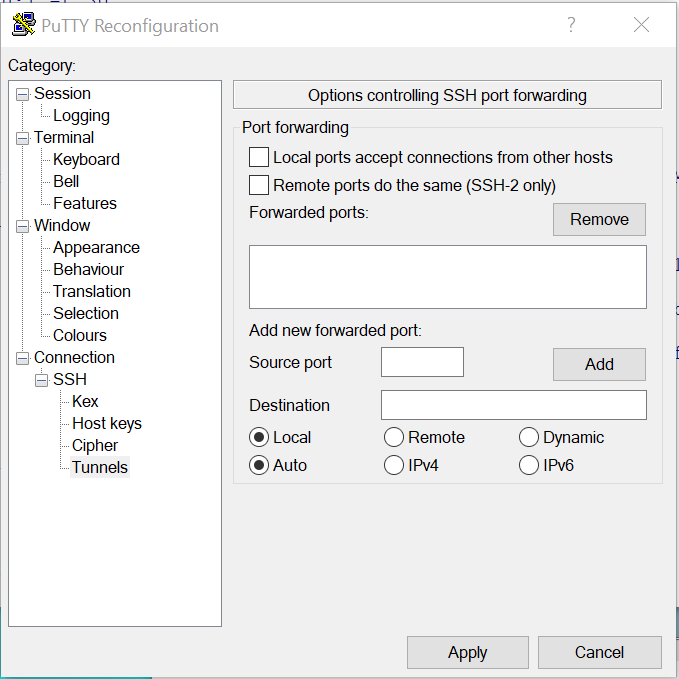
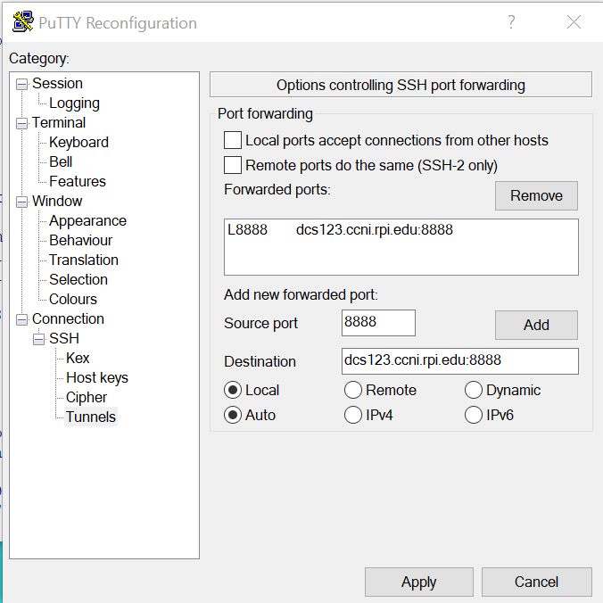
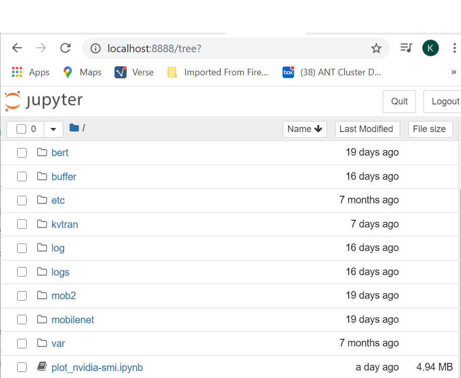

.. _setup-workload-env:
   
Set up the workload environment
===============================

The following sections describe various steps to set up the environment for your workload.  For example, install anaconda, create a conda environment for a specific workload, install jupyter notebook server, etc.

.. _load-module:

Load additional tools and libraries via module
^^^^^^^^^^^^^^^^^^^^^^^^^^^^^^^^^^^^^^^^^^^^^^

In AiMOS environment, the available tools are not in your PATH by default. If you need additional development tool and libraries, you can use **module** to display what is available and load the required tools and libraries for your development and testing.

List the complete list of available modules and extenstions, use **module spider**.  For example:

.. code:: bash

   [BMHRkmkh@dcsfen01]$ module spider

   -----------------------------------------------------------------------------------------------------------------------------------
   The following is a list of the modules and extensions currently available:
   -----------------------------------------------------------------------------------------------------------------------------------
    automake: automake/1.16.1
      Automake

    bazel: bazel/0.17.2/1, bazel/0.18.1/1, bazel/0.18.0/1, bazel/0.21.0/1
      Bazel build system

    ccache: ccache/3.5/1
      ccache compiler cache

    clang: clang/7.0.0/1
      LLVM + clang

    cmake: cmake/3.17.2
      CMake

    cuda: cuda/10.1, cuda/10.2
      NVIDIA CUDA

    fftw: fftw/3.3.8/1
      FFTW

    gcc: gcc/6.4.0/1, gcc/6.5.0/1, gcc/7.4.0/1, gcc/8.1.0/1, gcc/8.2.0/1, gcc/8.4.0/1
      GNU Compiler Collection (gcc)

    git: git/2.25.1
      git

    hdf5: hdf5/1.10.3/1
      HDF5

    hwloc: hwloc/2.0.2/1
      hwloc
  --More--
  

For example, you want to load cmake module and spectrum_mpi module

.. code:: bash

  (base) [your-id@dcsfen01 ~]$ module load  cmake/3.14.6
  (base) [your-id@dcsfen01 ~]$ which cmake
  alias cmake='cmake3'
          /usr/bin/cmake3
  (base) [your-id@dcsfen01 ~]$ which cmake3
  /usr/bin/cmake3
  (base) [your-id@dcsfen01 ~]$ module load spectrum-mpi
  (base) [your-id@dcsfen01 ~]$ which mpirun
  /opt/ibm/spectrum_mpi/bin/mpirun

For more information see https://secure.cci.rpi.edu/wiki/examples/Modules/

.. _install-conda:

Install Anaconda
^^^^^^^^^^^^^^^^^

Anaconda is not installed by default on AiMOS at the system level.  If you need the conda environment for your workload, you will need to install and set up in your environment.

**Prerequisites**

* You must login to one of the front end nodes. Please note that you need to use the appropriate front end node depending on the hardware architecture.  For more information see :ref:`how-to-login`

* Proxy was set up. For how to see :ref:`setup-environment`.

Download the Anaconda or  Miniconda3 installer applicable for the hardware architecture, i.e. ppc64le for DCS cluster or x86_64 for NPL cluster, as needed.  For example:

.. code:: bash

  wget https://repo.anaconda.com/miniconda/Miniconda3-latest-Linux-ppc64le.sh

Or 

.. code:: bash

   wget https://repo.anaconda.com/archive/Anaconda3-2020.07-Linux-x86_64.sh

For more information see https://secure.cci.rpi.edu/wiki/software/Conda/

**IMPORTANT NOTE**

The same GPFS filesystem is mounted on all the nodes in both DCS(Power) and NPL(x86) cluster.  You need to consider that if you include conda init in your ~/.bashrc as well as the .condarc.  You do not want things intended to run on Power running on X86 or vice versa. You may want to refer to :ref:`conda-init-bashrc` for example of setting up .bashrc to run the appropriate conda init for the environment.

This following example is to install the ppc64le miniconda environment to the scratch directory.

.. code:: bash

  [BMHRkmkh@dcsfen01 ~]$ bash Miniconda3-latest-Linux-ppc64le.sh -p ~/scratch/miniconda3
  
  Welcome to Miniconda3 4.7.12
  
  In order to continue the installation process, please review the license agreement.
  Please, press ENTER to continue
  >>>
  ...
  Do you accept the license terms? [yes|no]
  [no] >>> yes
  
  Miniconda3 will now be installed into this location:
  /gpfs/u/home/BMHR/BMHRkmkh/scratch/miniconda3
  
    - Press ENTER to confirm the location
    - Press CTRL-C to abort the installation
    - Or specify a different location below
  
  [/gpfs/u/home/BMHR/BMHRkmkh/scratch/miniconda3] >>>
  PREFIX=/gpfs/u/home/BMHR/BMHRkmkh/scratch/miniconda3
  Unpacking payload ...
  Collecting package metadata (current_repodata.json): done
  Solving environment: done
  
  ## Package Plan ##
  
    environment location: /gpfs/u/home/BMHR/BMHRkmkh/scratch/miniconda3
  
    added / updated specs:
      - _libgcc_mutex==0.1=main
      - asn1crypto==1.2.0=py37_0
      - ca-certificates==2019.10.16=0
  ...
    yaml               pkgs/main/linux-ppc64le::yaml-0.1.7-h1bed415_2
    zlib               pkgs/main/linux-ppc64le::zlib-1.2.11-h7b6447c_3
  
  
  Preparing transaction: done
  Executing transaction: done
  installation finished.
  Do you wish the installer to initialize Miniconda3
  by running conda init? [yes|no]
  [no] >>> yes
  no change     /gpfs/u/home/BMHR/BMHRkmkh/scratch/miniconda3/condabin/conda
  no change     /gpfs/u/home/BMHR/BMHRkmkh/scratch/miniconda3/bin/conda
  no change     /gpfs/u/home/BMHR/BMHRkmkh/scratch/miniconda3/bin/conda-env
  no change     /gpfs/u/home/BMHR/BMHRkmkh/scratch/miniconda3/bin/activate
  no change     /gpfs/u/home/BMHR/BMHRkmkh/scratch/miniconda3/bin/deactivate
  no change     /gpfs/u/home/BMHR/BMHRkmkh/scratch/miniconda3/etc/profile.d/conda.sh
  no change     /gpfs/u/home/BMHR/BMHRkmkh/scratch/miniconda3/etc/fish/conf.d/conda.fish
  no change     /gpfs/u/home/BMHR/BMHRkmkh/scratch/miniconda3/shell/condabin/Conda.psm1
  no change     /gpfs/u/home/BMHR/BMHRkmkh/scratch/miniconda3/shell/condabin/conda-hook.ps1
  no change     /gpfs/u/home/BMHR/BMHRkmkh/scratch/miniconda3/lib/python3.7/site-packages/xontrib/conda.xsh
  no change     /gpfs/u/home/BMHR/BMHRkmkh/scratch/miniconda3/etc/profile.d/conda.csh
  modified      /gpfs/u/home/BMHR/BMHRkmkh/.bashrc

  ==> For changes to take effect, close and re-open your current shell. <==
  
  If you'd prefer that conda's base environment not be activated on startup,
     set the auto_activate_base parameter to false:
  
  conda config --set auto_activate_base false
  
  Thank you for installing Miniconda3!
  [your-id@dcsfen01 ~]$
  [your-id@dcsfen01 ~]$ source .bashrc
  (base) [your-idh@dcsfen01 ~]$

  
Now you have the base conda installed and activated in your environment.

Frequently Used conda commands
^^^^^^^^^^^^^^^^^^^^^^^^^^^^^^

* Display conda information

.. code:: bash
   
   conda info

* List the available conda environments

.. code:: bash
      
   conda info --env

* Activate an environment. 

.. code:: bash
         
   conda activate <env name>

* Deactivate a current environment

.. code:: bash
            
   conda deactivate

* List the packages installed in a conda environment

.. code:: bash
            
   conda list

* List all available packages in the channels

.. code:: bash
            
   conda search

* Remove a package in a conda environment

.. code:: bash
            
   conda remove  <package name>

* Install a package in a conda environment

.. code:: bash
               
   conda install  <package name>

* Install a pip package in a conda environment 

.. code:: bash
                  
   pip install  <package name>

For more information see Conda cheatsheet at https://docs.conda.io/projects/conda/en/latest/_downloads/843d9e0198f2a193a3484886fa28163c/conda-cheatsheet.pdf

Create a new conda environment for your workload
^^^^^^^^^^^^^^^^^^^^^^^^^^^^^^^^^^^^^^^^^^^^^^^^

It is strongly recommended that you create a separate environment for your workload than the default base environment which comes with the installation of Anaconda.

For example that you want to create an environment named pytorch-env and install pytorch on to environment.

.. code:: bash
   
   conda create -n pytorch-env pytorch

**NOTE:**  you can specify additional packages in the command line.  You can also specify a specific version for the packages.

.. _install-wmlce:

Install WML-CE (a.k.a PowerAI)
^^^^^^^^^^^^^^^^^^^^^^^^^^^^^^

Watson Machine Learning Community Edition (WML-CE), formerly PowerAI, is a free, enterprise-grade software distribution that combines popular open source deep learning frameworks, efficient AI development tools, and accelerated IBM® Power Systems™ servers to take your deep learning projects to the next level.

For more information, see
https://developer.ibm.com/linuxonpower/deep-learning-powerai/releases/

**Prerequisites** 

* Log in to one of the front end nodes.  For more information see :ref:`how-to-login`

* Make sure that you set up the proxy before you proceed to the next step.  For how to see :ref:`setup-environment`.

* Anaconda is installed and activated. For more information see :ref:`install-conda`

Set up ~/.condarc if needed.  If ~/.condarc does not exist, you can run the following command to generate it::

  conda config

Below is the example of .condarc file. You need replace *your-project* with your PROJECT ID and *<your-id>* with your ID.   

.. code:: bash

  channels:
    - https://public.dhe.ibm.com/ibmdl/export/pub/software/server/ibm-ai/conda
    - powerai
    - defaults
    - conda-forge

As a best practice, you should install WML-CE in a new conda environment (i.e. not the base environment).  That would enable you to have different versions of WML-CE. 

**IMPORTANT:**  You also need to specify the python version since the only valid Python versions with WML CE are Python 3.6 and 3.7.

For more information on how to install WML-CE, see https://www.ibm.com/support/knowledgecenter/SS5SF7_1.7.0/navigation/wmlce_install.htm

As an example, here are the steps for creating a new conda environment named **wmlce-1.7.0** with python version 3.7. 

For automatically accept the license after the installation:

.. code:: bash

  export IBM_POWERAI_LICENSE_ACCEPT=yes

Create a new environment named "wmlce-1.7.0" with python version is set at 3.7/

.. code:: bash

  conda create --name wmlce-1.7.0 python=3.7

Activate the created conda environment.

.. code:: bash

  conda activate wmlce-1.7.0

Install WML-CE version 1.7.0 which is the latest version at the time of this writting.

* To install the **whole powerai GPU packages** in the created conda environment, run:

.. code:: bash

  conda install powerai

* To install the **whole powerai GPU packages** version 1.6.2

.. code:: bash

  conda install powerai=1.6.2

* To install an individual framework, such as **pytorch** or **tensorflow**.

For complete list of individual framework see https://www.ibm.com/support/knowledgecenter/SS5SF7_1.7.0/navigation/wmlce_install.htm

.. code:: bash

  conda install pytorch
  
Or

.. code:: bash

  conda install tensorflow-gpu

* To install powerai CPU packages only in the created conda environment, run:

.. code:: bash

  conda install powerai-cpu

* To install RAPIDS packages, run:

.. code:: bash

  conda install powerai-rapids

.. _install-jupyter:

Install Jupyter notebook
^^^^^^^^^^^^^^^^^^^^^^^^

The `Jupyter Notebook <https://jupyter.org/>`_ is an open-source web application.  It allows you to create and execute  notebook documents that contain code, visualizations and  text.  For more information see https://jupyter.org/ 

It is recommended to `install Jupyter notebook <https://jupyter.org/install.html>`_ in a miniconda environment which includes a minimal Python and conda installation. 

**Prerequisites**

* You are logging in to one of the front end nodes. For more information see :ref:`how-to-login`

* Proxy was set up. For how to see :ref:`setup-environment`.

* Conda is installed and activated. For more information see :ref:`install-conda`.

You can install Jupyter notebook via conda install or pip install.

If you plan to use the AI framework with your notebook, make sure that you install Jupyter notebook in the conda environment that includes the AI framework.  For example, if you want to use the AI frameworks that are included in the WML-CE, then you need to install Jupyter notebook in the environment that WML-CE was installed.  For more information on how to install WML-CE see ref:`install-wmlce`.

.. code:: bash

  conda install -c conda-forge notebook

Or

.. code:: bash

  pip install notebook

The example below is to install jupyter notebook on the wmlce-1.7.0 environment where you have installed WML-CE 1.7.0 as above.

.. code:: bash

  (base) [your-id@dcsfen01 wmlce-1.7.0]$ conda install -c conda-forge notebook
  Collecting package metadata (current_repodata.json): done
  Solving environment: done
  
  ## Package Plan ##
  
    environment location: /gpfs/u/home/BMHR/BMHRkmkh/scratch/miniconda3
  
    added / updated specs:
      - notebook
  
  
  The following packages will be downloaded:

      package                    |            build

Verify the notebook was installed.

.. code:: bash

  (base) [your-id@dcsfen01 wmlce-1.7.0]$ conda list | grep notebook
  notebook                  6.0.3                    py37_0    conda-forge

.. _start-jupyter:

Start Jupyter Notebook
^^^^^^^^^^^^^^^^^^^^^^

**Prerequisites:**

* You are logging in to one of the front end nodes. For more information see :ref:`how-to-login`

* Conda was installed and activated. For more information see :ref:`install-conda`.

* Jupyter notebook was installed. For how to  see :ref:`install-jupyter`.

Allocate a compute node
+++++++++++++++++++++++

For example, allocate a compute node for 30 minutes:

.. code:: bash

  salloc -N 1 --salloc -N 1 --gres=gpu:6 -t 30

After the command returns, you can run squeue to find the allocated node.

.. code:: bash

  squeue
           JOBID PARTITION     NAME     USER ST       TIME  NODES NODELIST(REASON)
          172886       dcs     bash BMHRkmkh  R       0:13      1 dcs085

After the command returns, you can run squeue to find the allocated node.

.. code:: bash

  (base) [your-id@dcsfen01 wmlce-1.7.0]$ conda list | grep notebook
  notebook                  6.0.3                    py37_0    conda-forge

Start Jupyter Notebook on the allocated compute node
++++++++++++++++++++++++++++++++++++++++++++++++++++

* SSH to the compute node

.. code:: bash

  (base) [BMHRkmkh@dcsfen01 ~]$ ssh dcs035
  Warning: Permanently added 'dcs035,172.31.236.35' (ECDSA) to the list of known hosts.

  (base) [BMHRkmkh@dcs035 ~]$
  
* Activate to the conda environment that is appropriated for your notebook.

.. code:: bash

  (base) [BMHRkmkh@dcs035 ~]$ conda activate wmlce-1.7.0

* Start Jupyter Notebook and set the notebook directory to the barn directory.  **NOTE:** you need to specify the absolute path for the notebook-dir.

.. code:: bash

  (wmlce-1.7.0) [BMHRkmkh@dcs035 scratch-shared]$ jupyter notebook --ip=0.0.0.0 --no-browser --notebook-dir=/gpfs/u/home/BMHR/BMHRkmkh/barn

Display the WebGUI for a Jupyter notebook via Tunneling
^^^^^^^^^^^^^^^^^^^^^^^^^^^^^^^^^^^^^^^^^^^^^^^^^^^^^^^

Prerequisites
+++++++++++++

Conda and jupyter notebook are installed on the node. For how to see :ref:`install-conda` and :ref:`install-jupyter`

Allocate a compute node
+++++++++++++++++++++++

For example, allocate a compute node for 30 minutes:

::

  salloc -N 1 --salloc -N 1 --gres=gpu:6 -t 30

After the command returns, you can run squeue to find the allocated node.

.. code:: bash

  squeue
             JOBID PARTITION     NAME     USER ST       TIME  NODES NODELIST(REASON)
            172886       dcs     bash BMHRkmkh  R       0:13      1 dcs085

Start the jupyter notebook on the allocated compute node
++++++++++++++++++++++++++++++++++++++++++++++++++++++++

You then ssh to the allocated node, activate to the appropriated conda environment, change directory to where the jupyter notebooks are in, then  starting jupyter notebook as follow:

.. code:: bash

  (wmlce-1.7.0) [your-id@dcs085 ~]$ jupyter notebook --ip=0.0.0.0 --no-browser

SSH tunnelling on a Linux or MAC OSX node
+++++++++++++++++++++++++++++++++++++++++

Start the ssh session to one of the landing pad nodes and map the port 8888 from dcs085 to port 8888 on the local host.  For example:

.. code:: bash

  [id@kvt-rhel ~]$ ssh -L8888:dcs085:8888 BMHRkmkh@blp01.ccni.rpi.edu

Go to the browser on the node, enter the following to tunnel to the jupyter notebook running on the compute node to the localhost.

.. code:: bash

  http://localhost:8888

You should see the jupyter notebook after you enter the token at the login prompt.

.. figure:: jupyter-l.png

SSH tunneling via PUTTY on Windows
++++++++++++++++++++++++++++++++++

Go to the putty entry for the landing pad node.  For example:

Go section Connection->SSH->Tunnels, enter the jupyter notebok URL on the compute node and click **Add**, for example:

Start the putty session and login to the landing node as usual.

After that, go to your browser and enter the following to tunnel to the jupyter notebook running on the compute node.

.. code:: bash

  http://localhost:18889

You should see the jupyter notebook after you enter the token at the login prompt.

