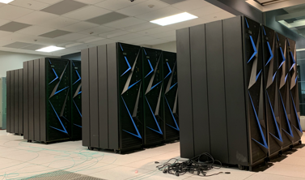

AiMOS Quick Start Information
=============================

The IBM Research AI Hardware Center is a global research hub headquartered in Albany, New York. The center is focused on enabling next-generation chips and systems that support the tremendous processing power and unprecedented speed that AI requires to realize its full potential. AiMOS (short for \ **A**\rtificial \ **I**\ntelligence \ **M**\ultiprocessing \ **O**\ptimized System) serves as the test bed for the IBM Research AI Hardware Center.

.. toctree::
   :maxdepth: 2
   :caption: Contents:

   aimos-basics.rst
   aimos-userid.rst
   aimos-env-basics.rst
   aimos-workload.rst
   aimos-submit-job.rst
   aimos-benchmark.rst
   aimos-hints-tips.rst
   aimos-getting-help.rst

